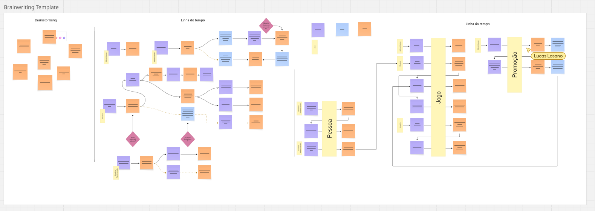
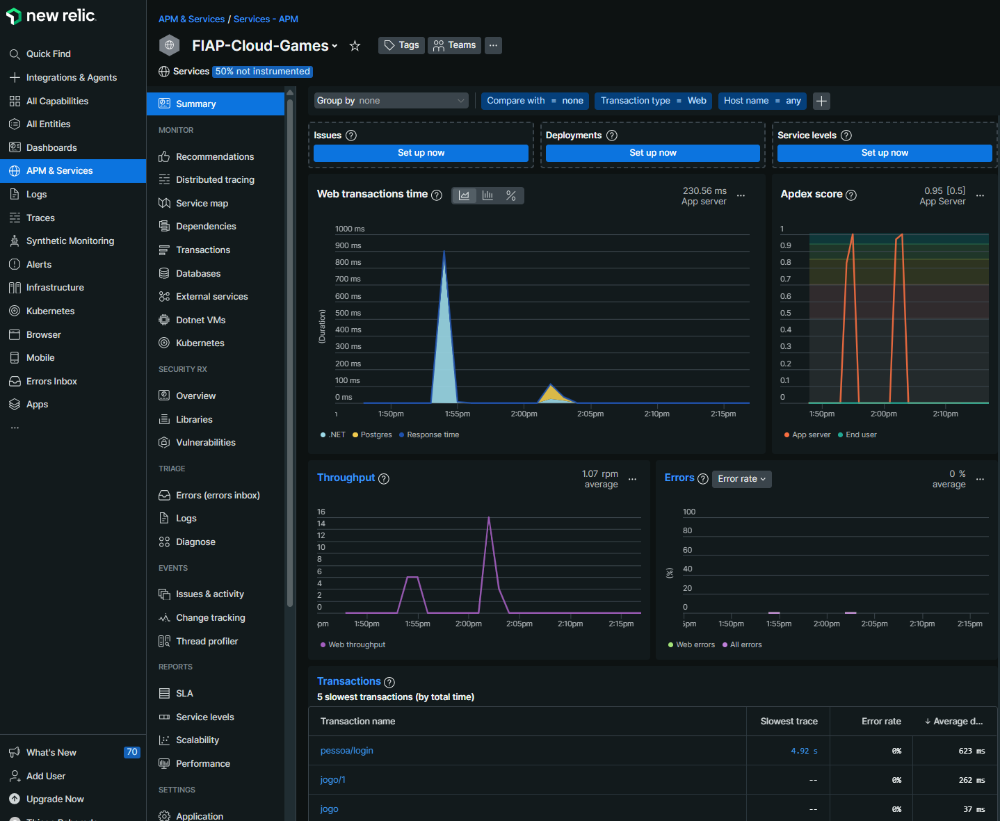

# FIAP Cloud Games 🚀

API RESTful para gerenciar usuários e biblioteca de jogos digitais, desenvolvida em **.NET 8** como MVP para a plataforma FIAP Cloud Games. Este repositório reúne todo o código-fonte, documentação e instruções de uso.

---

## Índice 📑

1.  [🎯 Objetivos](#-objetivos)
2.  [🖼️ Visão Geral do Projeto](#️-visão-geral-do-projeto)
3.  [📈 Diagrama de Estrutura](#-diagrama-de-estrutura)
4.  [🛠️ Tecnologias](#️-tecnologias)
5.  [📡 Monitoramento Contínuo com New Relic](#-monitoramento-contínuo-com-new-relic)
6.  [📋 Pré-requisitos](#-pré-requisitos)
7.  [📂 Estrutura do Repositório](#-estrutura-do-repositório)
8.  [⚙️ Configuração Inicial](#️-configuração-inicial)
9.  [▶️ Como Executar a API](#️-como-executar-a-api)
10. [🔗 Endpoints Principais](#-endpoints-principais)
11. [✅ Testes Unitários](#-testes-unitários)
12. [🤝 Contribuindo](#-contribuindo)
13. [📄 Licença](#-licença)

---

## 🎯 Objetivos

- **Cadastro de Usuários**

  - Persistir informações de clientes (nome, e-mail e senha) em PostgreSQL.
  - Validar formato de e-mail e exigir senha segura (mín. 8 caracteres, incluindo letras, números e caracteres especiais).

- **Autenticação e Autorização**

  - Autenticação via JWT.
  - Dois perfis de acesso:

    - **Usuário**: consulta catálogo e biblioteca de jogos.
    - **Administrador**: cadastra jogos, gerencia usuários e cria promoções.

- **Gerenciamento de Jogos**

  - CRUD completo de jogos (somente administradores), armazenando dados no PostgreSQL.

- **Qualidade de Software**

  - Segregação em camadas (Domain, Infrastructure, Application, API e Tests).
  - Testes unitários cobrindo regras principais de negócio.
  - Configuração de conexões PostgreSQL e Supabase no `appsettings.json`.
  - Documentação de endpoints via Swagger.

---

## 🖼️ Visão Geral do Projeto

O FIAP Cloud Games é um MVP que permite:

1. Cadastrar novos usuários (com perfis “Usuário” ou “Administrador”), gravando dados no PostgreSQL.
2. Autenticar-se via token JWT.
3. Listar, criar, editar e remover jogos (restrito a administradores), com armazenamento no PostgreSQL.
4. Consultar catálogo de jogos por qualquer usuário.
5. Monitorar a performance e a saúde da aplicação em tempo real.

Toda a lógica de persistência está isolada em projetos de **Application** e **Infrastructure**, seguindo boas práticas de Clean Architecture e SOLID, utilizando Entity Framework Core com provedor PostgreSQL.

---

## 📈 Diagrama de Estrutura



> Acesse o template completo no Miro: [Estrutura do Projeto no Miro](https://miro.com/welcomeonboard/cXE4Y1pzeTViMndSUTY3ZU9RQzdBK1l6S09GL29jb2JFc3FjcW0vYkpKSUJJVG40R1R5VGhXVlBvVEpsZ1hXY1l5NGhoTzlwY0hLa0xESGw3LzRCNlFWN0I5L1dYMUs4REFsQi9ocmtETjFGZG1ESGFJL3Vpb3FjZkFFSFRWdVFnbHpza3F6REdEcmNpNEFOMmJXWXBBPT0hdjE=?share_link_id=997573404815)

---

## 🛠️ Tecnologias

<p align="">
  <a href="https://skillicons.dev">
    
  </a>
</p>

- **Linguagem**: C# 10.0 (.NET 8)
- **Framework Web**: ASP.NET Core (Minimal API)
- **Banco de Dados**: PostgreSQL (via Entity Framework Core)
- **Auth**: JWT
- **Testes**: xUnit
- **Documentação**: Swagger UI
- **Versionamento**: GitHub (Git flow)
- **Conteinerização e CI/CD**: Docker, Azure DevOps
- **Monitoramento**: New Relic (APM)

---

## 📡 Monitoramento Contínuo com New Relic

Para garantir a alta performance e a confiabilidade da nossa API, o projeto foi instrumentado com o **New Relic APM (Application Performance Monitoring)**.

A integração foi feita diretamente no `Dockerfile`, instalando o agente do New Relic na imagem final da aplicação. As configurações sensíveis, como a chave de licença (`NEW_RELIC_LICENSE_KEY`) e o nome da aplicação (`NEW_RELIC_APP_NAME`), são gerenciadas de forma segura através de variáveis de ambiente, injetadas pelo serviço de hospedagem (Azure Container Apps), mantendo o código-fonte limpo de segredos.

Com o New Relic, obtemos visibilidade completa sobre:
* **Performance das Transações**: Tempo de resposta de cada endpoint da API.
* **Diagnóstico de Erros**: Rastreamento e análise de exceções em tempo real.
* **Métricas de Banco de Dados**: Identificação de queries lentas ou problemáticas.
* **Logs Centralizados**: Agregação dos logs da aplicação para facilitar a depuração.



---

## 📋 Pré-requisitos

Antes de começar, você precisa ter instalado:

1. **.NET 8 SDK** (8.0.x)
2. **PostgreSQL** (local ou hospedado)
3. **IDE ou Editor**: Visual Studio 2022 / Visual Studio Code / Rider
4. **Git** instalado e configurado para clonar repositórios

---

## 📂 Estrutura do Repositório

```
FIAP-Cloud-Games/
├── Application/              ← Casos de uso, DTOs e serviços de aplicação
├── Domain/                   ← Entidades, Value Objects e regras de negócio
├── Infrastructure/           ← Contexto EF Core (PostgreSQL), repositórios concretos
├── FIAP-Cloud-Games/         ← Projeto ASP.NET Core (Program.cs, EndPoints, Middlewares)
├── FIAP-Cloud-GamesTest/     ← Testes de unidade (xUnit, specflow)
├── .gitignore
└── README.md                 ← Este arquivo
```

- **Application**: contém `DTOs/`, `Services/`.
- **Domain**: define entidades principais (`Pessoa`, `Jogo`), Interfaces, Value Objects e Exceptions customizadas.
- **Infrastructure**: implementa `ApplicationDbContext` (PostgreSQL), migrações, repositórios.
- **FIAP-Cloud-Games**: projeto principal que expõe endpoints HTTP, middleware de autenticação e configurações de DI para PostgreSQL.
- **FIAP-Cloud-GamesTest**: contém casos de teste para validar lógica de negócio isolada de banco.

---

## ⚙️ Configuração Inicial

### 1. Clonar o Repositório

```bash
git clone https://github.com/LucasLosano/FIAP-Cloud-Games.git
cd FIAP-Cloud-Games
```

### 2. Restaurar Dependências

Após clonar o respositório, execute o comando na pasta FIAP-Cloud-Games/

```bash
    dotnet restore
```

---

### 3. Ajustar ConnectionString

Abra o arquivo FIAP-Cloud-Games/appsettings.json

```bash
{
  "ConnectionStrings": {
    "DefaultConnection": "Server=SEU_SERVIDOR;Database=FIAPCloudGames;User Id=SEU_USUARIO;Password=SUA_SENHA;"
  },
  "Jwt": {
    "Key": "ChaveSuperSecretaParaJWT",
    "Issuer": "FIAPCloudGamesAPI",
    "Audience": "FIAPCloudGamesClient",
    "ExpiresInMinutes": 60
  }
}
```

---

### 4. Aplicar Migrations

No terminal, dentro da pasta raiz do repositório, navegue até **Infrastructure/** e execute:

```bash
dotnet tool install --global dotnet-ef
```

```bash
cd Infrastructure
dotnet ef database update
```

---

## ✅ Testes Unitários

Toda a lógica de negócio crítica possui cobertura de testes em FIAP-Cloud-GamesTest. Para executar:

Abra um terminal na pasta do projeto de testes, **FIAP-Cloud-Games/FIAP-Cloud-GamesTest**, execute:

```bash
cd FIAP-Cloud-GamesTest
```

Execute:

```bash
dotnet test
```

---

## 📄 Licença

Este projeto está licenciado sob a MIT License. Sinta-se à vontade para clonar, adaptar e distribuir de acordo com os termos.
